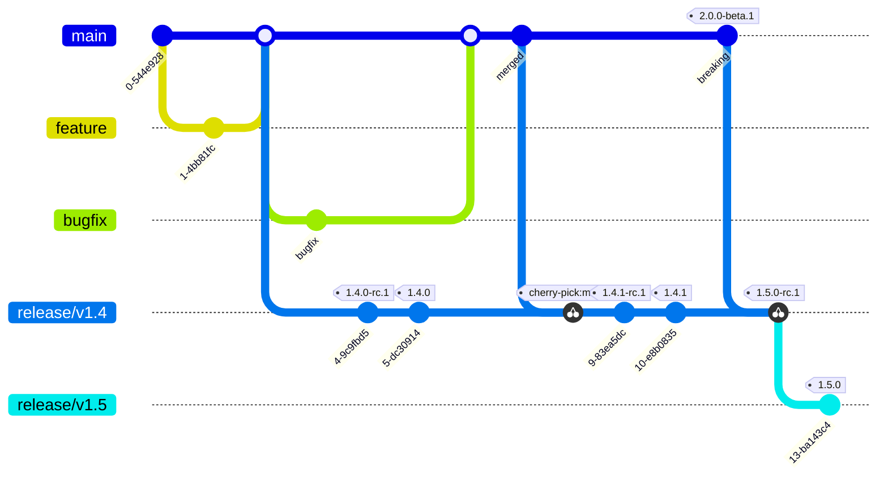

# Release Process

Lance maintains a linear commit history with a controlled release process.

* All pull requests are merged into the `main` branch first.
* Beta releases (or preview releases) are created on-demand from the `main` branch.
* Stable releases (non-prereleases) are created only after a voting process and come from a release branch `release/vX.Y`. These are typically created once every two weeks.
* Release Candidates (RC) are created from release branches prior to voting.
* Minor releases can be cut from either main branch or an existing release branch (when main is targeting a major release).
* Patch releases are created by committing fixes directly to the release branch, voting on a new RC, and releasing.
* All changes (features, fixes) must be committed to main first, then cherry-picked to release branches as needed.



## Version Semantics

Lance uses version numbers inspired by semantic versioning, but with flexibility for practical release management. Specifically, minor releases can be cut from existing release branches when the main branch is targeting a major release.

### Version Format

Lance uses version numbers with prerelease identifiers:
- **Stable**: `X.Y.Z` (e.g., `1.3.0`)
- **Beta**: `X.Y.Z-beta.N` (e.g., `1.3.0-beta.1`, `1.3.0-beta.2`)
- **RC**: `X.Y.Z-rc.N` (e.g., `1.3.0-rc.1`, `1.3.0-rc.2`)

### Beta Version States

- **beta.0**: Unreleased version (exists on branch but not published)
  - Created after cutting an RC to mark the next unreleased version
  - Indicates no preview has been published yet
- **beta.1+**: Published preview releases
  - Created when publishing beta preview artifacts

### Publishing Channels

| Language     | Stable release      | RC release                  | Beta release                |
|--------------|---------------------|-----------------------------|-----------------------------|
| **Rust**     | crates.io           | Not published (use git tag) | Not published (use git tag) |
| **Python**   | PyPI                | fury.io                     | fury.io                     |
| **Java**     | Maven Central       | Maven Central               | Maven Central               |
| **Protobuf** | Buf Schema Registry | Buf Schema Registry         | Buf Schema Registry         |

### GitHub Releases and Release Notes

| Release Type                       | GitHub Release Type | Start Commit (exclusive)    | End Commit (inclusive) | Explanation                                                          |
|------------------------------------|---------------------|-----------------------------|------------------------|----------------------------------------------------------------------|
| **Stable (Major/Minor from main)** | Release             | `release-root/X.Y.0-beta.N` | `vX.Y.0`               | All changes from main + RC fixes                                     |
| **Stable (Minor from release)**    | Release             | `vX.(Y-1).Z` (last stable)  | `vX.Y.0`               | Changes since last stable on source release branch                   |
| **Stable (Patch)**                 | Release             | `vX.Y.(Z-1)`                | `vX.Y.Z`               | Only changes in this patch release                                   |
| **RC (Major/Minor from main)**     | Pre-Release         | `release-root/X.Y.0-beta.N` | `vX.Y.0-rc.N`          | All changes for the release                                          |
| **RC (Minor from release)**        | Pre-Release         | `vX.(Y-1).Z` (last stable)  | `vX.Y.0-rc.N`          | Changes since last stable on source release branch                   |
| **RC (Patch)**                     | Pre-Release         | `vX.Y.(Z-1)`                | `vX.Y.Z-rc.N`          | Only changes in this patch release                                   |
| **RC (Iterations)**                | Pre-Release         | Same as initial RC          | `vX.Y.Z-rc.N`          | Same comparison as initial RC (not against previous RC)              |
| **Beta (Main branch)**             | Pre-Release         | `release-root/X.Y.Z-beta.N` | `vX.Y.Z-beta.N`        | Changes since last stable release RC cut in main branch              |
| **Beta (Release branch)**          | Pre-Release         | `vX.Y.(Z-1)`                | `vX.Y.Z-beta.N`        | Changes since last stable release                                    |

## Branching Strategy

### Main Branch

- Always contains the latest development work
- Version format: `X.Y.Z-beta.N`
- After RC creation, bumped to next minor version with `-beta.0` (unreleased)
  - Beta previews published by bumping to `-beta.1+`

### Release Branches

- Format: `release/v{major}.{minor}` (e.g., `release/v1.3`)
- Created when cutting initial RC for major/minor release
- Can be created from:
    - **Main branch**: Standard flow for major/minor releases
    - **Existing release branch**: For minor releases when main is targeting a major release
- Maintained for patch releases
- Version progression: `rc.1` → `rc.2` → stable → `beta.0` → `rc.1` (for patches)

### Commit Flow

All changes must be committed to the main branch first:

1. **Features and fixes**: Merge PR to main
2. **Release branch needs**: Cherry-pick from main to release branch
3. **Never commit directly to release branch** without the change existing in main first

This ensures main always has the complete history and release branches only contain subsets of main's changes.

## Version Flow

### Standard Flow (Major/Minor from Main)

```mermaid
%%{init: {'theme':'base', 'themeVariables': { 'fontSize':'14px'}}}%%
flowchart LR
    subgraph main["Main Branch"]
        direction LR
        M0["1.3.0-beta.2<br/>📍 release-root/1.4.0-beta.N<br/>📍 release-root/2.0.0-beta.N"] --> M1["1.4.0-beta.0"]
        M1 --> M2["1.4.0-beta.1<br/>🏷️ v1.4.0-beta.1"]
        M2 --> M3["2.0.0-beta.1<br/>🏷️ v2.0.0-beta.1"]
    end

    subgraph release["Release Branch: release/v1.3"]
        direction LR
        R1["1.3.0-rc.1<br/>🏷️ v1.3.0-rc.1"] --> R2["1.3.0<br/>🏷️ v1.3.0"]
        R2 --> R3["1.3.1-beta.0"]
        R3 --> R4["1.3.1-rc.1<br/>🏷️ v1.3.1-rc.1"]
        R4 --> R5["1.3.1<br/>🏷️ v1.3.1"]
        R5 --> R6["1.3.2-beta.0"]
    end

    M0 -.->|"create RC<br/>(no breaking changes)"| R1
```



**Flow explanation:**

- **Main branch**: Commit M0 at `1.3.0-beta.2` has `release-root/1.4.0-beta.N` (created when cutting v1.3.0-rc.1, pointing to this commit) and `release-root/2.0.0-beta.N` (created when breaking changes bumped major version, pointing to same commit) → M1 bumps to `1.4.0-beta.0` (unreleased) → M2 publishes `1.4.0-beta.1` (preview, tagged) → M3 publishes `2.0.0-beta.1` after detecting breaking changes (tagged)
- **Release branch** `release/v1.3` created from M0, starts at `1.3.0-rc.1` (tagged) → `1.3.0` (stable, tagged) → `1.3.1-beta.0` → `1.3.1-rc.1` (tagged) → `1.3.1` (stable, tagged) → `1.3.2-beta.0`
- **Tags**: 🏷️ = version tag (points to tagged commit), 📍 = release-root tag (points to commit before RC was created, used for breaking change detection)
- **Breaking changes**: Both `release-root/1.4.0-beta.N` and `release-root/2.0.0-beta.N` point to M0 (same commit), showing that 2.0.0 is a major version bump from the 1.3.0-rc.1 baseline

**Note**: All commits are linear on their respective branches. `beta.0` = unreleased, `beta.1+` = published previews.

### Minor Release from Release Branch (When Main is Major)

```mermaid
%%{init: {'theme':'base', 'themeVariables': { 'fontSize':'14px'}}}%%
flowchart LR
    subgraph main["Main Branch (at 2.0.0)"]
        direction LR
        M1["2.0.0-beta.0"] --> M2["2.0.0-beta.1<br/>🏷️ v2.0.0-beta.1"]
    end

    subgraph release13["Release Branch: release/v1.3"]
        direction LR
        R1["1.3.0<br/>🏷️ v1.3.0"] --> R2["1.3.1-beta.0"]
        R2 --> R3["1.3.1<br/>🏷️ v1.3.1"]
    end

    subgraph release14["Release Branch: release/v1.4"]
        direction LR
        S1["1.4.0-rc.1<br/>🏷️ v1.4.0-rc.1"] --> S2["1.4.0<br/>🏷️ v1.4.0"]
        S2 --> S3["1.4.1-beta.0"]
    end

    R3 -.->|"create minor release<br/>(main is at 2.x)"| S1
```



**Flow explanation:**

- **Main branch** is at `2.0.0-beta.N` (major version)
- **release/v1.3** has released `1.3.1` and needs a new minor release with features
- **release/v1.4** is created from `release/v1.3` (not from main) because main is at a different major version
- Release notes for `v1.4.0` compare against `v1.3.1` (latest stable on source branch)
- Main branch is NOT modified (already at 2.x)

## Workflows

### User-Facing Workflows

1. **publish-beta.yml** - Publish beta preview releases from any branch
2. **create-release-branch.yml** - Create release branch with initial RC for new major/minor version
    - From main: Standard flow for major/minor releases
    - From release branch: For minor releases when main is targeting a major release
3. **create-rc.yml** - Create RC on existing release branch (for new patch release RC or iterations of an existing RC)
4. **approve-rc.yml** - Approve any RC to stable (works for all release types)

## Create a Beta / Preview Release

**Purpose**: Publish preview releases for testing before creating release candidates.

**Steps**:
1. Trigger **"Publish Beta"** workflow
2. Set **branch**: `main` (or any release branch)
3. Set **dry_run**: `true` (test first)
4. Review results, then run with **dry_run**: `false`

**Result**: Creates a beta tag (e.g., `v1.4.0-beta.1`) and publishes preview artifacts to fury.io, Maven Central, and Buf Schema Registry.

**Release Notes**: For the first beta (beta.1), release notes include all changes since the release-root tag. For subsequent betas (beta.2+), release notes only include incremental changes since the previous beta.

<details>
<summary>How beta versioning works</summary>

**For main branch**: Automatically checks for breaking changes and bumps version:
- **No breaking changes**: Increments beta (e.g., `1.4.0-beta.0` → `1.4.0-beta.1`)
- **Breaking changes found**: Bumps major and resets beta (e.g., `1.4.0-beta.1` → `2.0.0-beta.1`)
- **Already bumped**: Just increments beta (e.g., `2.0.0-beta.1` → `2.0.0-beta.2`)

**For release branches**: Bumps beta number (`beta.N` → `beta.N+1`)

**Use cases**:
- Testing features before RC
- Regular preview releases for early adopters
- Automatic breaking change detection
</details>

## Breaking Change Detection

**How it works**: Mark PRs with the `breaking-change` label in GitHub. The workflow automatically detects these and bumps the major version when publishing beta releases from main.

**What counts as breaking**:
- Upgrading pinned dependencies in public API (DataFusion, Arrow)
- Changing signatures of public functions/methods
- Removing public functions/methods
- Changing public data structures
- **Exception**: Experimental APIs (marked as such in docs) are not considered breaking

<details>
<summary>Technical details: Release root tags and version bumping</summary>

### Release Root Tag

Release root tags mark the base commits for breaking change detection. The tag naming reflects the **beta version series on main**, while the tag points to the **RC commit being compared against**.

**Tag Format**: `release-root/{major}.{minor}.{patch}-beta.N`
- The tag name indicates which beta version series uses this base
- The tag points to the commit on main branch before the RC was created (the comparison base)
- The tag message stores the base RC version (e.g., "Base: 1.3.0-rc.1") - this is what we compare against to detect major version bumps
- The base RC version in the message stays constant even when multiple release-root tags point to the same commit

**When created**:
1. **When creating a major/minor RC**: After bumping main to the next version
   - Example: After cutting v1.3.0-rc.1, create `release-root/1.4.0-beta.N` pointing to the commit before the RC branch was created
2. **When breaking changes bump major version**: When major version is bumped during beta publish
   - Example: When bumping 1.4.0-beta.5 → 2.0.0-beta.1, create `release-root/2.0.0-beta.N` pointing to the SAME commit with the SAME base RC version

**Key properties**:

- **Multiple tags, same commit**: `release-root/1.4.0-beta.N` and `release-root/2.0.0-beta.N` point to the same commit on main (the commit before the RC branch was created)
- **Major version bumped once**: Both tags store same base RC version (1.3.0-rc.1), so we know 2.x is already a major bump from 1.3.0
- **No additional bumps**: When at 2.0.0-beta.1, we detect breaking changes but see major already bumped (2 > 1), so just increment beta
- **Beta reset on major bump**: When bumping major version, beta number resets to 1 (e.g., 1.4.0-beta.5 → 2.0.0-beta.1)

### Minor Release Root Tag

When a minor release is created from an existing release branch (not from main), a `minor-release-root` tag is created to track the comparison base for release notes.

**Tag Format**: `minor-release-root/{major}.{minor}.0`

- Created when using `create-release-branch` workflow with `source_release_branch` parameter
- Tag message contains the source stable tag (e.g., `v1.3.1`)
- Used by `determine_previous_tag` to find the correct comparison base

**Example**: When creating `release/v1.4` from `release/v1.3` (where latest stable is v1.3.1):

- Creates `minor-release-root/1.4.0` with message `v1.3.1`
- Release notes for v1.4.0-rc.N and v1.4.0 will compare against v1.3.1

### Detection Process

Breaking change detection happens **on every beta publish from main branch**:

1. **Find release-root tag**: Look for `release-root/{current_version}-beta.N`
   - If NOT found → Bump minor only (no comparison base exists, skip breaking change detection)
2. **Extract base RC version**: Read from tag message (e.g., "Base: 1.3.0-rc.1" → base major is `1`)
3. **Compare**: Check for breaking changes since the commit pointed to by the release-root tag
4. **Determine action**:
   - If breaking changes AND current_major == base_major → bump to next major
   - If breaking changes AND current_major > base_major → no bump (already bumped)
   - If no breaking changes → no major bump

### Examples

Starting from v1.3.0-rc.1 cut, main at 1.4.0-beta.0 with `release-root/1.4.0-beta.N` (Base: 1.3.0-rc.1):
- `1.4.0-beta.0` + no breaking → `1.4.0-beta.1`
- `1.4.0-beta.1` + breaking → `2.0.0-beta.1`
  - Creates `release-root/2.0.0-beta.N` pointing to same commit, message still "Base: 1.3.0-rc.1"
  - Base major from tag message is 1, current major is 1, so bump to 2
- `2.0.0-beta.1` + breaking → `2.0.0-beta.2`
  - Base major is 1, current major is 2 (already bumped), so just increment beta
- `2.0.0-beta.2` + no breaking → `2.0.0-beta.3`

**Key insight**: Multiple beta version series can share the same release-root commit, with major version bumped only once when first detected.
</details>

## Create a Major / Minor Release (from Main)

**Purpose**: Create a new major or minor release from the main branch.

**Steps**:

1. Ensure CI on main is green
2. Trigger **"Create Release Branch"** workflow with **dry_run**: `true`
3. Review the RC version and changes
4. Run with **dry_run**: `false` to create release branch and RC
5. Test RC artifacts (published to fury.io, Maven Central)
6. Vote in the GitHub Discussion thread (created automatically)
7. **If issues found**: Fix on release branch, run **"Create RC"** workflow to create `rc.2`, `rc.3`, etc.
8. **If approved**: Trigger **"Approve RC"** workflow with **rc_tag** (e.g., `v1.3.0-rc.2`)

**Result**:

- Creates release branch (e.g., `release/v1.3`) with RC tag (e.g., `v1.3.0-rc.1`)
- Bumps main to next minor (e.g., `1.4.0-beta.0`)
- After approval: Creates stable tag (e.g., `v1.3.0`) and publishes to PyPI, crates.io, Maven Central

<details>
<summary>What happens under the hood</summary>

**Create Release Branch workflow**:

- Reads current version from main (e.g., `1.3.0-beta.2`)
- Checks for breaking changes since release-root tag
- If breaking changes: Creates RC with bumped major (e.g., `2.0.0-rc.1`), bumps main to `2.1.0-beta.0`
- If no breaking changes: Creates RC with current version (e.g., `1.3.0-rc.1`), bumps main to `1.4.0-beta.0`
- Creates `release/v{major}.{minor}` branch from main HEAD
- Creates GitHub Discussion for voting

**Approve RC workflow**:

- Bumps version from `rc.N` to stable
- Generates release notes comparing against `release-root/{version}-beta.N` tag
- Creates GitHub Release and publishes stable artifacts
- Auto-bumps release branch to next patch `beta.0` (e.g., `1.3.0` → `1.3.1-beta.0`)
- Main branch is NOT affected (already bumped in step 1)
</details>

## Create a Minor Release (from Release Branch)

**Purpose**: Create a new minor release from an existing release branch when main is targeting a major release.

**When to use**: When main branch has breaking changes and is targeting a major version (e.g., `2.0.0`), but you need to release new features for users who aren't ready to upgrade to the new major version.

**Prerequisites**:

- Main branch must be at a major version (e.g., `2.0.0-beta.N` where patch = 0 and minor = 0)
- Source release branch must exist (e.g., `release/v1.3`)
- Features to release must already be committed to main, then cherry-picked to the source release branch

**Steps**:

1. Cherry-pick desired features from main to the source release branch
2. Trigger **"Create Release Branch"** workflow with:
    - **source_release_branch**: e.g., `release/v1.3`
    - **dry_run**: `true`
3. Review the minor RC version (e.g., `1.4.0-rc.1`)
4. Run with **dry_run**: `false` to create new release branch and RC
5. Test RC artifacts and vote in the GitHub Discussion
6. **If issues found**: Fix and run **"Create RC"** workflow
7. **If approved**: Trigger **"Approve RC"** workflow

**Result**:

- Creates new release branch (e.g., `release/v1.4`) from source branch
- Creates RC tag (e.g., `v1.4.0-rc.1`)
- Main branch is NOT modified (already at major version)
- Release notes compare against latest stable on source branch (e.g., `v1.3.1`)
- After approval: Creates stable tag and publishes artifacts

<details>
<summary>What happens under the hood</summary>

**Create Release Branch workflow (with source_release_branch)**:

- Validates main is at major version (`X.0.0-beta.N` where patch = 0)
- Checks out source release branch (e.g., `release/v1.3`)
- Reads current version from source branch
- Increments minor version (e.g., `1.3.1-beta.0` → `1.4.0-rc.1`)
- Creates new release branch (e.g., `release/v1.4`) from source branch HEAD
- Finds latest stable tag on source branch for release notes comparison
- Does NOT modify main branch
- Creates GitHub Discussion for voting

**Key differences from main branch flow**:

- No breaking change detection (assumes features are already validated)
- No release-root tag created (not needed for this flow)
- Main branch version unchanged
- Release notes compare against source branch's latest stable release
</details>

## Create a Patch / Bugfix Release

**Purpose**: Release critical bug fixes for an existing release.

**Steps**:

1. Commit the fix to main branch first (all changes must go to main first)
2. Cherry-pick the fix to the release branch (e.g., `release/v1.3`)
3. Trigger **"Create RC"** workflow with **release_branch** (e.g., `release/v1.3`) and **dry_run**: `true`
4. Review the patch RC version
5. Run with **dry_run**: `false` to create the patch RC
6. Test RC artifacts and vote in the GitHub Discussion
7. **If issues found**: Fix and run **"Create RC"** again to create `rc.2`, `rc.3`, etc.
8. **If approved**: Trigger **"Approve RC"** workflow with **rc_tag** (e.g., `v1.3.1-rc.1`)

**Result**:

- Creates patch RC tag (e.g., `v1.3.1-rc.1`) on release branch
- After approval: Creates stable tag (e.g., `v1.3.1`) and publishes to PyPI, crates.io, Maven Central
- Auto-bumps release branch to next patch `beta.0` (e.g., `1.3.2-beta.0`)
- Main branch is NOT affected

<details>
<summary>Important notes</summary>

- **Commit to main first**: All fixes must be committed to main before cherry-picking to release branches
- **Breaking changes not allowed**: Patch releases should not introduce breaking changes
- **Beta versions**: Release branches stay at `X.Y.Z-beta.N` between releases (auto-bumped after stable)
- **Release notes**: Compares against previous stable tag (e.g., `v1.3.0`)
- **Allowed changes**: Correctness bugs, security fixes, major performance regressions, unintentional breaking change reverts
</details>

## Example Workflows

### Beta Preview Release

```bash
# 1. Main at 1.4.0-beta.0 (unreleased after RC cut for v1.3.0)
# 2. Want to publish preview for testing
Workflow: Publish Beta
  branch: main
  Result:
    - Looks for release-root/1.4.0-beta.N → found
    - Extracts base: 1.3.0-rc.1 (major: 1) from tag message
    - No breaking changes detected
    - Bumped to 1.4.0-beta.1
    - Tagged v1.4.0-beta.1
    - Created GitHub Pre-Release with release notes from release-root/1.4.0-beta.N to v1.4.0-beta.1
    - Published artifacts to fury.io

# 3. More changes, publish again (with breaking changes)
Workflow: Publish Beta
  branch: main
  Result:
    - Looks for release-root/1.4.0-beta.N → found
    - Extracts base: 1.3.0-rc.1 (major: 1) from tag message
    - Breaking changes detected, current major (1) == base major (1)
    - Bumped to 2.0.0-beta.1 (beta resets on major bump)
    - Created release-root/2.0.0-beta.N → same commit, message "Base: 1.3.0-rc.1"
    - Tagged v2.0.0-beta.1
    - Created GitHub Pre-Release with release notes from release-root/2.0.0-beta.N to v2.0.0-beta.1
    - Published artifacts to fury.io

# 4. More changes, publish again (still has breaking changes)
Workflow: Publish Beta
  branch: main
  Result:
    - Looks for release-root/2.0.0-beta.N → found
    - Extracts base: 1.3.0-rc.1 (major: 1) from tag message
    - Breaking changes detected, but current major (2) > base major (1)
    - No major bump needed (already bumped)
    - Bumped to 2.0.0-beta.2
    - Tagged v2.0.0-beta.2
    - Created GitHub Pre-Release with release notes from release-root/2.0.0-beta.N to v2.0.0-beta.2
    - Published artifacts to fury.io
```

### Standard Major/Minor Release

```bash
# 1. Main is at 1.3.0-beta.2
# 2. Create release branch (version auto-determined from main)
Workflow: Create Release Branch
  Result:
    - Checks for breaking changes since release-root/1.3.0-beta.N
    - No breaking changes detected
    - Created release/v1.3 at 1.3.0-rc.1
    - Tagged v1.3.0-rc.1
    - Created GitHub Pre-Release with release notes from release-root/1.3.0-beta.N to v1.3.0-rc.1
    - Bumped main to 1.4.0-beta.0 (unreleased)
    - Tagged release-root/1.4.0-beta.N → points to commit before RC branch, message "Base: 1.3.0-rc.1"
    - GitHub Discussion created

# 3. Vote on RC
  - Navigate to Discussion thread
  - Test RC artifacts
  - Vote with +1, 0, -1

# 4. Approve RC
Workflow: Approve RC
  rc_tag: v1.3.0-rc.1
  Result:
    - release/v1.3 @ 1.3.0 (stable)
    - Tagged v1.3.0
    - Generated release notes comparing v1.3.0 vs release-root/1.3.0-beta.N
    - Created GitHub Release (not pre-release)
    - Stable artifacts published
    - Release branch auto-bumped to 1.3.1-beta.0
    - Main unchanged (already at 1.4.0-beta.0)

# 5. Later: Publish first beta after RC (no breaking changes)
Workflow: Publish Beta
  branch: main
  Result:
    - Looks for release-root/1.4.0-beta.N → found
    - Extracts base: 1.3.0-rc.1 (major: 1) from tag message
    - No breaking changes detected
    - Bumped from 1.4.0-beta.0 to 1.4.0-beta.1
    - Tagged v1.4.0-beta.1
    - Created GitHub Pre-Release with release notes from release-root/1.4.0-beta.N to v1.4.0-beta.1
    - Published artifacts to fury.io

# 6. More changes, publish second beta (breaking changes introduced!)
Workflow: Publish Beta
  branch: main
  Result:
    - Looks for release-root/1.4.0-beta.N → found
    - Extracts base: 1.3.0-rc.1 (major: 1) from tag message
    - Breaking changes detected, current major (1) == base major (1)
    - Bumped from 1.4.0-beta.1 to 2.0.0-beta.1 (beta resets on major bump)
    - Created release-root/2.0.0-beta.N → same commit, message "Base: 1.3.0-rc.1"
    - Tagged v2.0.0-beta.1
    - Created GitHub Pre-Release with release notes from release-root/2.0.0-beta.N to v2.0.0-beta.1
    - Published artifacts to fury.io

# 7. More changes, publish third beta (still has breaking changes)
Workflow: Publish Beta
  branch: main
  Result:
    - Looks for release-root/2.0.0-beta.N → found
    - Extracts base: 1.3.0-rc.1 (major: 1) from tag message
    - Breaking changes detected, but current major (2) > base major (1)
    - No major bump needed (already bumped from base)
    - Bumped to 2.0.0-beta.2
    - Tagged v2.0.0-beta.2
    - Published artifacts

# 8. Eventually: Cut RC for v2.0.0
Workflow: Create Release Branch
  Result:
    - Main at 2.0.0-beta.2
    - Checks for breaking changes since release-root/2.0.0-beta.N
    - No additional breaking changes (major already bumped)
    - Created release/v2.0 at 2.0.0-rc.1
    - Tagged v2.0.0-rc.1
    - Bumped main to 2.1.0-beta.0
    - Tagged release-root/2.1.0-beta.N → points to commit before RC branch, message "Base: 2.0.0-rc.1"
```

### Patch Release

```bash
# 1. Start with release/v1.3 @ 1.3.1-beta.0 (auto-bumped after previous stable release)
# 2. Critical bug found in 1.3.0
# 3. Fix committed to main first, then cherry-picked to release/v1.3
# 4. Create patch RC
Workflow: Create RC
  release_branch: release/v1.3
  Result:
    - Branch at 1.3.1-beta.0
    - Created 1.3.1-rc.1
    - Tagged v1.3.1-rc.1
    - Created GitHub Pre-Release with release notes from v1.3.0 to v1.3.1-rc.1
    - GitHub Discussion created

# 5. Vote passes
# 6. Approve patch RC
Workflow: Approve RC
  rc_tag: v1.3.1-rc.1
  Result:
    - release/v1.3 @ 1.3.1
    - Tagged v1.3.1
    - Generated release notes comparing v1.3.1 vs v1.3.0
    - Created GitHub Release (not pre-release)
    - Stable artifacts published
    - Auto-bumped to 1.3.2-beta.0 (ready for next patch)
    - Main unchanged
```

### Minor Release from Release Branch

```bash
# Scenario: Main is at 2.0.0-beta.N (major version), need to release v1.4.0 with new features

# 1. Main is at 2.0.0-beta.1 (breaking changes introduced)
# 2. release/v1.3 is at 1.3.1-beta.0 (after releasing v1.3.1)
# 3. Cherry-pick desired features from main to release/v1.3

# 4. Create minor release branch from release/v1.3
Workflow: Create Release Branch
  source_release_branch: release/v1.3
  Result:
    - Validates main is at major version (2.0.0-beta.1)
    - Source branch at 1.3.1-beta.0
    - Created release/v1.4 at 1.4.0-rc.1
    - Tagged v1.4.0-rc.1
    - Found latest stable: v1.3.1
    - Created GitHub Pre-Release with release notes from v1.3.1 to v1.4.0-rc.1
    - Main NOT modified (stays at 2.0.0-beta.1)
    - GitHub Discussion created

# 5. Vote on RC (3-day voting for minor release)
  - Navigate to Discussion thread
  - Test RC artifacts
  - Vote with +1, 0, -1

# 6. Approve RC
Workflow: Approve RC
  rc_tag: v1.4.0-rc.1
  Result:
    - release/v1.4 @ 1.4.0
    - Tagged v1.4.0
    - Generated release notes comparing v1.4.0 vs v1.3.1
    - Created GitHub Release (not pre-release)
    - Stable artifacts published
    - Release branch auto-bumped to 1.4.1-beta.0
    - Main unchanged (stays at 2.0.0-beta.1)

# 7. Future: Can continue with patches on release/v1.4 or create release/v1.5 from it
```

### RC Iteration Due to Issues

```bash
# 1. Create initial RC
RC: v1.3.0-rc.1 on release/v1.3

# 2. Issue found during testing
# 3. Fix committed to release/v1.3 branch
# 4. Create new RC
Workflow: Create RC
  release_branch: release/v1.3
  Result:
    - Branch at 1.3.0-rc.1
    - Auto-incremented to 1.3.0-rc.2
    - Tagged v1.3.0-rc.2
    - Created GitHub Pre-Release with release notes from release-root/1.3.0-beta.N to v1.3.0-rc.2 (same comparison as rc.1, showing all changes)
    - GitHub Discussion created

# 5. Vote passes
# 6. Approve rc.2
Workflow: Approve RC
  rc_tag: v1.3.0-rc.2
  Result:
    - release/v1.3 @ 1.3.0
    - Tagged v1.3.0
    - Generated release notes comparing v1.3.0 vs release-root/1.3.0-beta.N (includes fixes from rc.1 and rc.2)
    - Created GitHub Release (not pre-release)
    - Stable artifacts published
    - Release branch auto-bumped to 1.3.1-beta.0
    - Main unchanged
```
